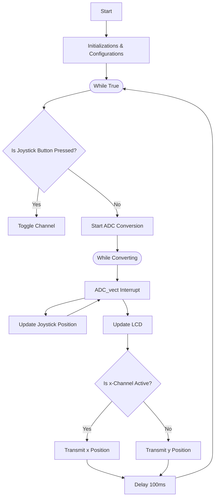

# Joystick Analog Data - Dual Channel UART Transmission

## DESCRIPTION

The joystick data transmitter is an embedded system that gathers (x, y) position data from a KY-023 joystick sensor module, and transmits either the x-channel or y-channel via UART protocol. It was implemented on the
ATMega328-P microcontroller using bare metal C programming and the avr-libc library.

When the device is powered from a +5V supply, the joystick outputs its (x, y) position as two analog voltages in the 0–5V range (e.g., x = 3.3V, y = 1.6V). Each voltage corresponds to a 10-bit ADC reading, giving
1024 possible positions per axis. At the joystick’s rest position, the ADC readings sit near (512, 512). The microcontroller continuously samples both channels via its ADC and displays the real-time biaxial
offsets on a 16×2 LCD. The processed x-axis data is then transmitted over UART by default, and the joystick’s pushbutton (digital Z input) toggles which axis is being sent.

---

---

## FEATURES

- 10-bit analog sampling of dual-axis joystick

- Real-time LCD display of biaxial offsets

- Configurable UART transmission (channel toggle via pushbutton)

- Debounced digital input handling

- Bare-metal AVR implementation (no Arduino framework or abstraction layers)

- LCD driver integration (HD44780)

- Low-latency serial output suitable for control systems

---

## FLOWCHART

---

## FIRMWARE PACKAGE

#### C Files
1. Main Program (`joystick_UART_main.c`)
2. High level LCD Driver (`lcd.c`)
3. Low Level LCD Driver (`hd44780.c`)

#### Header Files
1. Central Configuration File (`defines.h`)
2. LCD Driver Header (`lcd.h`)
3. LCD Driver Header (`hd44780.h`)

---

## USAGE NOTES

- Ensure that the receiving device is configured to handle a bit transfer rate (baud rate) of 38.4k bps sampling rate of 10Hz.
  
- The system transmits a byte in an 8N1 data frame. Ensure the receiving device is configured to handle this data format.

  | S | 7 | 6 | 5 | 4 | 3 | 2 | 1 | 0 | P |
  | - | - | - | - | - | - | - | - | - | - |
  
- The joystick reaches its full scale values at approximately ⅔ of the full motion range.
  
- Fast joystick motion will make it difficult to read data from the LCD, and will create larger gaps in the transmission samples.
  
- Use in short distance transmission applications. Long distance transmission at a high baud rate can lead to extra noise and data corruptions.

---

## DEVICE SPECIFICATIONS

| **Parameter** | **Typical** | **Minimum** | **Maximum** | **Unit** |
|-------------- | ----------- | ----------- | ----------- | -------- |
| | | | | |
| **Electrical** | | | | |
| Voltage (Wall Out) | 120 | - | - | Vrms |
| Voltage (Device In) | 5 | 3.3 | 6 | VDC |
| Current (Device In) | 44.3 | 1.5 | 200 | mA |
| Power Consumption | 221.5 | - | - | mW |
| **Mechanical** | | | | |
| Push Button Force | - | 0.98 ± 0.29 | - | N |
| L x W x H | 16.5 x 5.5 x 1.0 | - | - | cm |
| Power Cord Length | 180 | - | - | cm |
| **Serial Transmission** | | | | |
| Protocol | UART | - | - | - |
| Baud Rate | 37422 | - | - | bit/s |
| Sampling Rate | 10.29 | 9.89 | 10.85 | Hz |
| Data Frame | 8N1 | - | - | - |
| Frame Transit Time | 481 | - | - | ms |
| Chanels | 2 | - | - | - |
| Transmission Type | Single Channel | - | - | - |
| High Logic | 5 | - | - | V |
| Low Logic | 0 | - | - | V |
| **Environment** | | | | |
| Temperature | 25 | -25 | 70 | C |
| Humidity | - | 35% | 85% | - |

---

## COMPONENTS & COST ANALYSIS

| **Component**     | **Quantity**      | **Unit Cost**     | **Purchase Link** | **Total Cost**    |
| ----------------- | ----------------- | ----------------- | ----------------- | ----------------- |
| ATMega328-P Microcontroller | 1 | $4.47 | [DigiKey](https://www.digikey.ca/en/products/detail/microchip-technology/ATMEGA328P-PU/1914589) | $4.47 |
| KY-023 Joystick Module | 1 | $4.95 | [DigiKey](https://secure.sayal.com/STORE4/prodetails.php?SKU=262361&utm_source=google) | $4.95 |
| MPLAB Snap Debugger | 1 | $15.30 | [DigiKey](https://www.digikey.ca/en/products/detail/microchip-technology/PG164100/9562532) | $15.30 |
| AVR Programming Adapter | 1 | $32.09 | [DigiKey](https://www.microchip.com/en-us/development-tool/AC31S18A) | $32.09 |
| 16x2 HD44780LCD Display | 1 | $10.95 | [DigiKey](https://www.adafruit.com/product/1) | $10.95 |
| CT-94 EY103 Potentiometer | 1 | $3.45 | [DigiKey](https://www.digikey.ca/en/products/detail/nidec-components-corporation/CT-94EY103/738422) | $3.45 |
| 6V AC Wall Adapter | 1 | $16.22 | [DigiKey](https://www.digikey.ca/en/products/detail/triad-magnetics/WDU6-600/6819576) | $16.22 |
| MCP1702 Voltage Regulator | 1 | $1.01 | [DigiKey](https://www.digikey.ca/en/products/detail/microchip-technology/MCP1702-3002E-TO/1098462) | $1.01 |
| 47uF Capacitor | 2 | $0.15 | [DigiKey](https://www.digikey.ca/en/products/detail/w%C3%BCrth-elektronik/860020472006/5727060) | $0.30 |
| | | | | |
| **Total** | | | | $88.74 |

